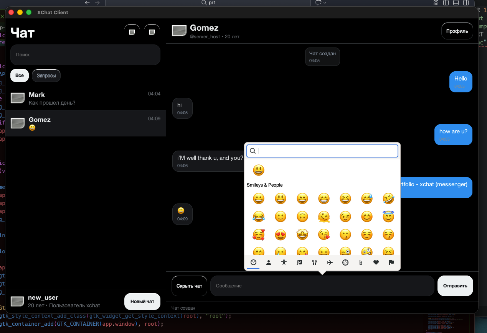

# Xchat-Messenger




# XChat (GTK3)

Минималистичный TCP-чат с графическим интерфейсом на GTK3.
Проект написан на C и работает на **macOS** и **Linux**.

## Возможности

* GTK3 GUI (тёмная тема, современный стиль)
* TCP клиент и сервер (IPv4)
* Подключение по IP и порту
* Окно создания нового чата
* Профиль пользователя
* Сохранение профиля в файл
* Автоматическая загрузка профиля при запуске
* Работа через `cc` + `pkg-config`

---

## 🖥 Поддерживаемые системы

* macOS
* Linux

Требуется установленный GTK3.

---

## 📦 Зависимости

Убедитесь, что установлен GTK3.

### macOS (через Homebrew)

```bash
brew install gtk+3
```

### Ubuntu / Debian

```bash
sudo apt install libgtk-3-dev
```

---

## ⚙️ Сборка

Компиляция производится через `cc` и `pkg-config`.

### Сервер

```bash
cc ser.c -o server `pkg-config --cflags --libs gtk+-3.0` -lpthread
```

### Клиент

```bash
cc cli.c -o client `pkg-config --cflags --libs gtk+-3.0` -lpthread
```

---

## ▶️ Запуск

Сначала запустите сервер:

```bash
./server
```

Затем клиент:

```bash
./client
```

---

## 👤 Профиль пользователя

В приложении есть кнопка **«Профиль»**.

Можно указать:

* Имя
* Фамилию
* Username (начинается с @)
* Описание
* Возраст

После нажатия **«Сохранить»** данные записываются в файл конфигурации.

### 📁 Где хранится профиль

Файл сохраняется в системной директории конфигурации:

* macOS:
  `~/Library/Application Support/xchat_profile.conf`

* Linux:
  `~/.config/xchat_profile.conf`

При следующем запуске данные автоматически загружаются.

---

## 🏗 Архитектура проекта

```
ser.c   — TCP сервер с GUI
cli.c   — TCP клиент с GUI
```

Проект использует:

* POSIX sockets
* pthread
* GTK3
* Препроцессорные директивы для кроссплатформенности

---

## 🔮 Планируемые улучшения

* Поддержка нескольких клиентов
* Неблокирующие сокеты
* Автопереподключение
* Никнеймы в чате
* История сообщений
* Улучшенная валидация профиля

---

## 📜 Лицензия

Проект создан в образовательных целях.

---

## ✨ Автор

Разработано в рамках эксперимента по созданию собственного GUI-чата на C + GTK3.
